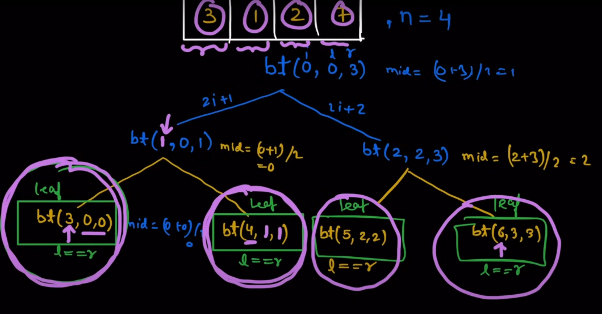

# Segment_Tree
All about the segment tree


# 🌲 Segment Tree

Segment Tree is a powerful and efficient data structure used for:

- 📌 Efficient querying of intervals/ranges (e.g., sum, minimum, maximum).
- 🔁 Efficient updating of intervals/ranges in logarithmic time.

---

## 📊 Use Cases: Range Queries

Segment Trees are ideal for answering the following types of range queries efficiently:

1. Sum of elements in a range.
2. Minimum or maximum value in a range.
3. GCD, LCM, XOR, and custom associative operations over a range.

Segment Tree is your go-to solution when **both** querying and updating operations are involved frequently.

---

## 🛠 How to Build a Segment Tree?

Before building, understand these key points:

- ✅ The Segment Tree is a **binary tree**, where:
  - Internal nodes represent ranges.
  - Leaf nodes represent single elements of the array.

Let the array be:  
`arr = {3, 1, 2, 7, 1}`

### Structure:

- Each node covers a certain range `(l, r)`.
- The range is divided at the midpoint:  
  `mid = (l + r) / 2`
  - Left child covers: `(l, mid)`
  - Right child covers: `(mid + 1, r)`

- Base condition:  
  Recursion stops when `l == r`, meaning a single element is reached (leaf node).

- The **root** represents the whole array range.
- The **height** of the tree is approximately `log₂(n)`.
- The **total number of nodes** is approximately `2N - 1`.

---

## ❓ Why Not Use Prefix Sum for Range Sum?

**Prefix sum arrays** allow constant time range sum queries, but:

- ❌ They do **not support updates efficiently** (O(n) time complexity).
- ✅ Segment Trees allow both:
  - Range queries in **O(log n)**
  - Updates in **O(log n)**

Hence, **Segment Trees > Prefix Sums** when updates are involved.

---

## 💻 Code: Build Segment Tree (Pseudocode / C++ style)



```cpp
void BuildTree(int index, int left, int right) {
    if (left == right) {
        segment[index] = arr[right];  // or arr[left]
        return;
    }
    int mid = (left + right) / 2;
    BuildTree(2 * index + 1, left, mid);       // Build left child
    BuildTree(2 * index + 2, mid + 1, right);  // Build right child
    segment[index] = segment[2 * index + 1] + segment[2 * index + 2]; // Combine results
}


## WHAT WILL BE THE SIZE OF SEGMENT ARRAY ❓❓
 
 - LEAF NODE : N
 - INTERNAL NODE : N-1
 -TOTAL NODE=N+(N-1)

 ---

## TIME COMPLEXITY ❓
- visiting all nodes twice 
- building segment tree: O(N)


```cpp
void updateTREE(vector<int> &segmentTree, int index, int val, int i, int left, int right)
{
    // index is the index of rth
    if (left == right)
    {
        segmentTree[i] = val;
        return;
    }
    int mid = (left + right) / 2;

    if (index <= mid)
    {
        updateTREE(segmentTree, index, val, 2 * i + 1, left, mid);
    }
    else
    {
        updateTREE(segmentTree, index, val, 2 * i + 2, mid + 1, right);
    }
    segmentTree[i] = segmentTree[2 * i + 1] + segmentTree[2 * i + 2];
}


```cpp
int Query(vector<int> &segmentTree, int start, int end, int i, int left, int right)
{

    if (left > end || right < start)
    {
        return 0;
    }
    if (left >= start && right <= end)
    {
        return segmentTree[i];
    }
    int mid = (left + right) / 2;
    return Query(segmentTree, start, end, 2 * i + 1, left, mid) + Query(segmentTree, start, end, 2 * i + 2, mid + 1, right);
}